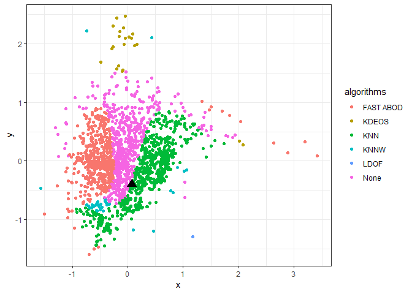
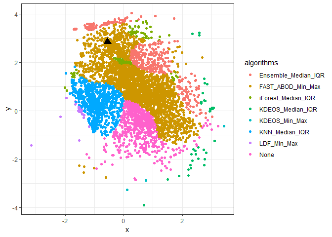

<!-- README.md is generated from README.Rmd. Please edit that file -->
outselect
=========

[](https://travis-ci.org/sevvandi/outselect)

The goal of outselect (outlier detection method selection) is to select suitable outlier detection methods for a given dataset using meta-features. The functionality is available to reproduce some instance space results in our papers (Kandanaarachchi et al. 2018) and (Kandanaarachchi, Muñoz, and Smith-Miles 2019).

This package is still under development and this repository contains a development version of the R package *outselect*.

Installation
------------

You can install outselect from github with:

``` r
#install.packages("devtools")
devtools::install_github("sevvandi/outselect")
```

Features
--------

Details on features can be found [here.](./Features.Rmd)

Min-Max Normalization
---------------------

These examples are related to the work in (Kandanaarachchi, Muñoz, and Smith-Miles 2019) and use Min-Max normalization and the outlier detection methods described in (Campos et al. 2016). For all examples we use the dataset *Arrhythmia\_withoutdupl\_05\_v05*, which is described in (Campos et al. 2016).

### Example 1

This example shows how to compute the meta-features and predict which outlier method is good for the dataset *Arrhythmia\_withoutdupl\_05\_v05*.

``` r
library(outselect)
data(Arrhythmia_withoutdupl_05_v05)
dat <- Arrhythmia_withoutdupl_05_v05
feat <- ComputeMetaFeaturesMM(dat)
#> [1] "Computing 178 features. This will take some time."
fit <- TrainModels(1,1,1)
#> [1] "Training models on meta-features. This will take some time."
out <- PredictPerformance(feat, fit)
out
#>        COF FAST_ABOD INFLO KDEOS   KNN  KNNW  LDF  LDOF   LOF  LOOP  ODIN
#> [1,] 0.348      0.44 0.544 0.034 0.478 0.544 0.34 0.534 0.536 0.704 0.508
#>      SIMLOF
#> [1,]  0.664
```

### Example 2

This example shows how to plot the instance *Arrhythmia\_withoutdupl\_05\_v05* on the Min-Max instance space.

``` r
library(outselect)
data(Arrhythmia_withoutdupl_05_v05)
dat <- Arrhythmia_withoutdupl_05_v05
feat <- ComputeMetaFeaturesMM(dat)
#> [1] "Computing 178 features. This will take some time."
svmout <- InstSpace(d=1)
#> [1] "Training 12 SVMS for outlier detection methods. This will take some time."
PlotNewInstance(svmout, feat, vis=TRUE)
```



    #>            x          y
    #> 1 0.07454883 -0.3991142

Min-Max and Median-IQR normalization methods
--------------------------------------------

These examples are related to the work in (Kandanaarachchi et al. 2018). We use Min-Max and Median-IQR normalization methods for feature computation. For the instance space we use the following normalization and outlier detection method combinations:

1.  Ensemble Median-IQR
2.  LOF Min-Max
3.  KNN Median-IQR
4.  FAST ABOD Min-Max
5.  iForest Median-IQR
6.  KDEOS Median-IQR
7.  KDEOS Min-Max and
8.  LDF Min-Max

Again, for all examples we use the dataset *Arrhythmia\_withoutdupl\_05\_v05*, which is described in (Campos et al. 2016).

### Example 3

This example shows how to compute the meta-features and predict which outlier-normalization combination is good for the dataset *Arrhythmia\_withoutdupl\_05\_v05*.

``` r
library(outselect)
data(Arrhythmia_withoutdupl_05_v05)
dat <- Arrhythmia_withoutdupl_05_v05
feat <- ComputeMetaFeaturesAll(dat)
#> [1] "Computing 346 features. This will take some time."
fit <- TrainModels(d=2,1,1)
#> [1] "Training models on meta-features. This will take some time."
out <- PredictPerformance(feat, fit)
out
#>      Ensemble_Median_IQR LOF_Min_Max KNN_Median_IQR FAST_ABOD_Min_Max
#> [1,]               0.522       0.544          0.552             0.768
#>      iForest_Median_IQR KDEOS_Median_IQR KDEOS_Min_Max LDF_Min_Max
#> [1,]              0.472            0.002         0.018       0.144
```

### Example 4

This example plots the same instance in the outlier-normalization algorithm instance space.

``` r
library(outselect)
data(Arrhythmia_withoutdupl_05_v05)
dat <- Arrhythmia_withoutdupl_05_v05
feat <- ComputeMetaFeaturesAll(dat)
#> [1] "Computing 346 features. This will take some time."
svmout <- InstSpace(d=2)
#> [1] "Training 8 SVMS for outlier detection methods. This will take some time."
PlotNewInstance(svmout, feat, vis=TRUE)
```



    #>            x        y
    #> 1 -0.5563485 2.851412

References
----------

Campos, Guilherme O, Arthur Zimek, Jörg Sander, Ricardo JGB Campello, Barbora Micenková, Erich Schubert, Ira Assent, and Michael E Houle. 2016. “On the Evaluation of Unsupervised Outlier Detection: Measures, Datasets, and an Empirical Study.” *Data Mining and Knowledge Discovery* 30 (4). Springer: 891–927.

Kandanaarachchi, Sevvandi, Mario Andres Muñoz, and Kate Smith-Miles. 2019. “Instance Space Analysis for Unsupervised Outlier Detection.” Working Paper.

Kandanaarachchi, Sevvandi, Mario Andres Muñoz, Rob J Hyndman, and Kate Smith-Miles. 2018. “On Normalization and Algorithm Selection for Unsupervised Outlier Detection.” Working Paper. <https://www.researchgate.net/publication/327621932_On_normalization_and_algorithm_selection_for_unsupervised_outlier_detection>.
